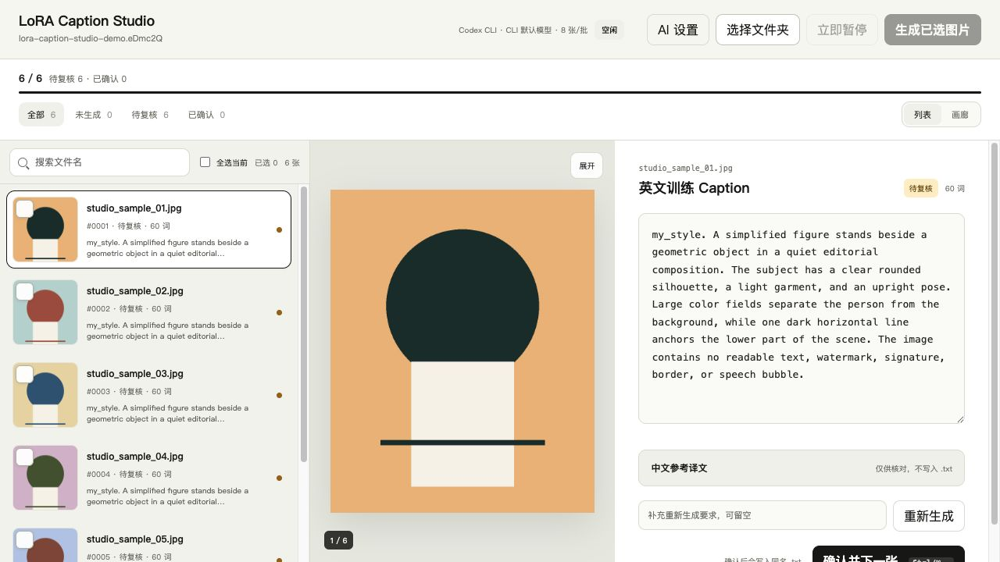

# LoRA Caption Studio

LoRA Caption Studio 是一个本地运行、跨平台的图片批量打标与人工复核工具。它读取你选择的 JPG、PNG 或 WebP 文件夹，通过 Codex CLI 或 OpenAI API 生成英文 LoRA caption，并把最终确认内容写成与图片同名的 `.txt` 文件。

项目不会上传整个文件夹、复制或重命名原图。只有被选中的图片会在生成时发送给当前 AI Provider；打标状态、缩略图和可选凭据保存在当前用户的本机目录中。



## 功能

- 在“全部”中勾选需要打标的图片，支持搜索与全选；选中的图片会出现在“未生成”中。
- 列表与画廊两种浏览方式，批量生成、立即暂停、失败项重试和逐张复核。
- 可以直接输入中文补充要求，AI 会把要求融入最终英文 caption。
- 支持编辑 caption、查看中文参考译文、重新生成当前图片，以及确认后写入同名 `.txt`。
- 失败栏目只在真实失败时出现，重试入口位于失败页面。
- 支持 Codex CLI 和 OpenAI API，两者通过统一 Provider 接口接入。
- LoRA 触发词可配置，不绑定特定人物、画风或本地数据集。

## 环境要求

- macOS 12+ 或 Windows 10/11。
- Python 3.10 或更高版本。建议使用 [Python 官方安装包](https://www.python.org/downloads/)。
- 网络连接：首次安装 Python 依赖时需要；使用 AI Provider 时也需要。
- 二选一的 AI Provider：
  - 已安装并登录的 Codex CLI；或
  - 自己的 OpenAI API Key。API 调用会产生费用，请查看 [OpenAI API 定价](https://developers.openai.com/api/docs/pricing)。

项目不包含 Codex CLI、模型文件、数据集、测试图片或任何 API Key。

## macOS 安装

从 GitHub 项目的 **Code** 菜单复制仓库地址，然后在终端运行：

```bash
git clone <从 GitHub 复制的仓库地址>
cd lora-caption-studio
./start_macos.command
```

启动器会检查 Python 版本，在项目内创建 `.venv`，安装 `requirements.txt`，检测系统 `PATH` 中是否存在 `codex`，然后打开本地页面。首次安装会比之后启动慢。

如果 Finder 阻止直接打开，可在终端执行：

```bash
chmod +x start_macos.command
./start_macos.command
```

手动安装与启动：

```bash
python3 -m venv .venv
.venv/bin/python -m pip install -r requirements.txt
.venv/bin/python -m lora_caption_studio
```

## Windows 安装

安装 Python 时请启用 **Add python.exe to PATH**。从 GitHub clone 后，可以双击 `start_windows.bat`，或在 PowerShell 中运行：

```powershell
git clone <从 GitHub 复制的仓库地址>
cd lora-caption-studio
./start_windows.bat
```

启动器会优先使用 Windows Python Launcher `py`，创建 `.venv`、安装依赖、检测 `codex`，然后启动本地页面。

手动安装与启动不需要修改 PowerShell 执行策略：

```powershell
py -3 -m venv .venv
.venv\Scripts\python -m pip install -r requirements.txt
.venv\Scripts\python -m lora_caption_studio
```

## Codex CLI 配置

1. 按 [Codex CLI 官方文档](https://developers.openai.com/codex/cli) 安装 Codex。项目只通过系统 `PATH` 查找 `codex`，不会读取或调用 ChatGPT 桌面 App 内部的可执行文件。
2. 在终端运行：

   ```bash
   codex
   ```

3. 首次运行时按官方提示登录，然后返回 LoRA Caption Studio。
4. 打开页面右上角“AI 设置”，选择 **Codex CLI**。模型留空时使用 Codex CLI 默认模型，也可以填写当前 CLI 支持的模型 ID。

如果页面提示找不到 Codex，请先在新终端执行 `codex --version`。命令仍不存在时，重新按照官方文档安装并确认安装目录已加入 `PATH`，再重启本项目。

## OpenAI API 配置

在页面右上角打开“AI 设置”，选择 **OpenAI API**：

1. 输入自己的 OpenAI API Key。
2. 选择或填写支持图像输入与结构化输出的模型，例如默认的 `gpt-5.6-luna`。模型能力与可用性请以 [OpenAI 模型文档](https://developers.openai.com/api/docs/models) 为准。
3. 设置 LoRA 触发词。
4. 默认不勾选“保存到此电脑”时，Key 只存在于当前 Python 进程，退出即清除。勾选后，Key 才会写入当前操作系统的用户配置目录。

也可以使用环境变量。复制 `.env.example` 为 `.env`，填写本机值；`.env` 已被 `.gitignore` 排除：

macOS：

```bash
cp .env.example .env
```

Windows：

```powershell
Copy-Item .env.example .env
```

不要提交 `.env`。OpenAI 官方也要求把 API Key 视为秘密，不能暴露在客户端代码或公开仓库中；参见 [API 身份验证说明](https://developers.openai.com/api/reference/overview#authentication)。

本项目不会把 Key 写入源码、普通设置文件、打标状态或日志，也不会通过 `/api/data` 返回 Key。用户主动选择保存时，凭据位于：

- macOS：`~/Library/Application Support/LoRA Caption Studio/openai_credentials.json`
- Windows：`%LOCALAPPDATA%\LoRA Caption Studio\openai_credentials.json`

这是本机凭据文件，不是系统钥匙串。如果不希望落盘，请保持“保存到此电脑”未勾选，或只使用进程环境变量。

## 启动

推荐入口：

- macOS：`start_macos.command`
- Windows：`start_windows.bat`
- 任意平台手动启动：`python -m lora_caption_studio`

只检查 Python、虚拟环境、依赖和 Codex 可用性，不启动服务：

```bash
python bootstrap.py --check
```

默认地址是 `http://127.0.0.1:8766/`，只监听本机回环地址。可用参数：

```bash
python -m lora_caption_studio --help
python -m lora_caption_studio --no-open --port 9000
python -m lora_caption_studio "/path/to/images"
```

Windows 路径示例：

```powershell
.venv\Scripts\python -m lora_caption_studio "D:\datasets\my-images"
```

## 选择图片文件夹

1. 点击“选择文件夹”，选择直接包含图片的目录。
2. 支持 `.jpg`、`.jpeg`、`.png` 和 `.webp`；当前版本只扫描所选目录的第一层，不递归扫描子文件夹。
3. 程序首次载入时会计算 SHA-256 并在用户数据目录创建清单、状态和缩略图。原图不会被复制、压缩或重命名。
4. 已存在的同名 `.txt` 会作为待复核 caption 载入。生成时不会无提示覆盖外部人工 caption。

运行状态默认位于：

- macOS：`~/Library/Application Support/LoRA Caption Studio/Data`
- Windows：`%LOCALAPPDATA%\LoRA Caption Studio\Data`

## 批量打标

1. 在“全部”中勾选图片，或使用“全选当前”。
2. 进入“未生成”，按需输入中文补充要求。
3. 点击“生成已选图片”。默认每批 8 张、最多 4 批并行。
4. 生成期间可以“立即暂停”。Codex CLI 进程会被终止；OpenAI 请求如果已经发出，返回结果会被丢弃，不会写入 caption。
5. 在“待复核”逐张修改英文 caption，展开中文参考译文核对，最后点击“确认并下一张”。
6. 确认后的内容写入图片旁边的同名 `.txt`。中文译文只用于页面核对，不写入训练文件。

AI caption 只是初稿。训练前请人工检查人物、物体、动作、可见文字、触发词和不确定细节。

## 常见问题

### 页面提示“未检测到 Codex CLI”

程序可以继续启动。打开“AI 设置”切换到 OpenAI API，或安装 Codex 后重启。项目不会尝试从 ChatGPT 桌面 App 或其他应用的私有目录寻找 Codex。

### Codex 已安装，但页面仍检测不到

关闭后从能成功运行 `codex --version` 的终端启动本项目。Windows 上请重新打开 PowerShell，使新的 `PATH` 生效。

### OpenAI API 返回 401、模型不可用或额度错误

检查 API Key、项目额度和模型访问权限。模型名称会变化，请以官方模型页面为准。Key 不等同于 ChatGPT 订阅。

### 点击“选择文件夹”没有反应

请使用 Python 官方发行版，确保包含 Tk。也可以在启动命令末尾直接传入图片文件夹路径。

### 为什么图片变化后无法继续？

为了避免 caption 与图片错位，程序会核对文件名和 SHA-256。请重新选择文件夹，或恢复被移动、替换的图片。状态文件位于用户数据目录，不在图片目录中。

### 会修改哪些文件？

原图不会修改。确认或生成成功后会在图片旁写入同名 `.txt`。应用状态、缩略图和设置写在当前用户目录；仓库本身只会生成 `.venv`，且已被 Git 忽略。

### 如何彻底清除本机 API Key？

在“AI 设置”中点击“清除本机已保存的 Key”。如果使用 `.env` 或系统环境变量，还需要自行删除对应值。

## 开发与测试

```bash
python -m pip install -r requirements.txt
python -m unittest discover -s tests -v
python -m compileall -q lora_caption_studio tests bootstrap.py
```

Provider 接口位于 `lora_caption_studio/providers.py`。新增 Provider 时实现 `AIProvider` 的可用性检查、模型标签、生成和取消方法即可，不需要改动批处理状态机。

GitHub Actions 会在 macOS 与 Windows、Python 3.10 与 3.13 上运行编译、单元测试和“无 Codex、无 API Key 仍可启动”的基础检查。

## 隐私与发布边界

- 仓库不包含数据集、测试图片、个人绝对路径、用户名、Cookie、Token 或真实 API Key。
- README 截图使用程序生成的几何测试图，不来自私人训练数据。
- `.gitignore` 排除了虚拟环境、`.env`、常见凭据文件、数据集、运行状态、缩略图、日志和模型输出。
- 本地服务默认只绑定 `127.0.0.1`。不要把它直接暴露到公网。

## License

[MIT](LICENSE)
